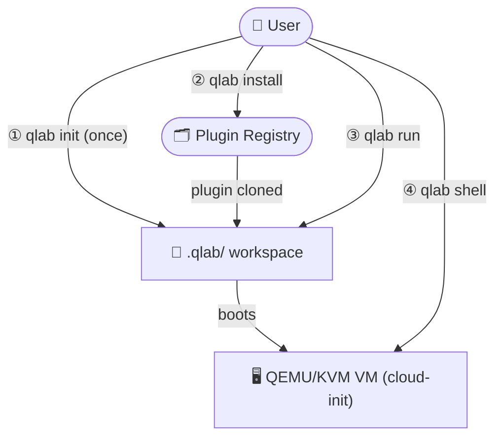
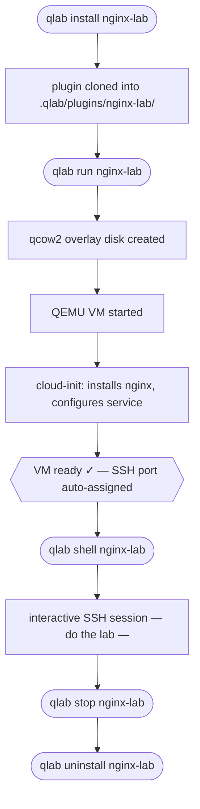

# QLab

[](https://github.com/manzolo/qlab/actions/workflows/ci.yml)
[](LICENSE)
[](https://www.gnu.org/software/bash/)
[](https://www.kernel.org/)

> **Modular CLI tool for QEMU/KVM educational labs.**

QLab makes it easy to create, share, and run hands-on virtualization labs. Each lab is a **plugin** that spins up one or more QEMU virtual machines, fully provisioned via cloud-init — so students learn by doing, with zero manual setup.

---

## How It Works



### Lab lifecycle example: `nginx-lab`



---

## Features

| | Feature | Details |
|---|---|---|
| 🔌 | **Plugin-based labs** | Each lab is a self-contained plugin — install, run, share |
| ☁️ | **Cloud-init provisioning** | VMs boot fully configured, zero manual setup |
| 💾 | **Overlay disks** | qcow2 copy-on-write snapshots keep base images untouched |
| 🔑 | **Auto SSH keys** | Passwordless login, generated once per workspace |
| 🖥️ | **Serial console + SSH** | Connect via `qlab shell` or nographic console |
| 🗂️ | **Plugin registry** | Install labs from a local or remote registry |
| 🐚 | **Pure Bash** | No frameworks, no compilation — just shell scripts |
| 🎛️ | **TUI manager** | Interactive menu-driven interface via `dialog` |

---

## Quick Start

```bash
# Install QLab
curl -fsSL https://raw.githubusercontent.com/manzolo/qlab/main/install.sh | sudo bash

# Create and initialize a workspace
mkdir my-lab && cd my-lab
qlab init

# Install and run your first lab
qlab install hello-lab
qlab run hello-lab

# Connect to the VM
qlab shell hello-lab
```

Default VM credentials: **`labuser`** / **`labpass`** (SSH key login is automatic).

---

## Commands

| Command | Description |
|---------|-------------|
| `qlab init` | Initialize a new workspace |
| `qlab install <name>` | Install a plugin (bundled, registry, or git URL) |
| `qlab run <name>` | Run a lab (boots VM with cloud-init) |
| `qlab shell <name>` | SSH into a running VM |
| `qlab stop <name>` | Stop a running VM |
| `qlab reset [name]` | Reset a single plugin, or the entire workspace |
| `qlab log <name>` | Tail the VM boot log |
| `qlab status` | Show workspace and VM status |
| `qlab list installed` | Show installed plugins |
| `qlab list available` | Show registry plugins |
| `qlab ports` | Show SSH port map and detect conflicts |
| `qlab uninstall <name>` | Remove a plugin |
| `qlab test <name>` | Run a plugin's automated test suite |
| `qlab manager` | Open interactive TUI (requires `dialog`) |

---

## Available Plugins

Install any plugin with `qlab install <name>` or browse them all with `qlab list available`.

**🚀 Getting started**

| Plugin | VMs | Description |
|--------|:---:|-------------|
| [hello-lab](https://github.com/manzolo/qlab-plugin-hello-lab) | 1 | Basic VM boot lab with cloud-init |

**🌐 Web servers**

| Plugin | VMs | Description |
|--------|:---:|-------------|
| [nginx-lab](https://github.com/manzolo/qlab-plugin-nginx-lab) | 1 | Nginx web server installation and configuration |
| [apache-lab](https://github.com/manzolo/qlab-plugin-apache-lab) | 1 | Apache web server with SSL/TLS and virtual hosts |

**🗄️ Databases**

| Plugin | VMs | Description |
|--------|:---:|-------------|
| [mysql-lab](https://github.com/manzolo/qlab-plugin-mysql-lab) | 1 | MySQL/MariaDB database management, users, and backups |
| [postgres-lab](https://github.com/manzolo/qlab-plugin-postgres-lab) | 1 | PostgreSQL with pgAdmin for database management |

**📦 Containers & DevOps**

| Plugin | VMs | Description |
|--------|:---:|-------------|
| [docker-lab](https://github.com/manzolo/qlab-plugin-docker-lab) | 1 | Docker containers and Docker Compose |
| [git-lab](https://github.com/manzolo/qlab-plugin-git-lab) | 1 | Git: commits, branches, merge, conflicts, stash, rebase, git flow |

**💾 Storage**

| Plugin | VMs | Description |
|--------|:---:|-------------|
| [lvm-lab](https://github.com/manzolo/qlab-plugin-lvm-lab) | 1 | LVM with extra virtual disks for PV, VG, and LV management |
| [raid-lab](https://github.com/manzolo/qlab-plugin-raid-lab) | 1 | LVM & ZFS disk management with 4 extra disks |

**⚙️ System administration**

| Plugin | VMs | Description |
|--------|:---:|-------------|
| [systemd-lab](https://github.com/manzolo/qlab-plugin-systemd-lab) | 1 | Systemd service management, unit files, timers, and journald |

**🔒 Security & authentication**

| Plugin | VMs | Description |
|--------|:---:|-------------|
| [ssh-lab](https://github.com/manzolo/qlab-plugin-ssh-lab) | 1 | SSH hardening with fail2ban, port knocking, and key auth |
| [firewall-lab](https://github.com/manzolo/qlab-plugin-firewall-lab) | 2 | Firewall with iptables, ufw, and traffic analysis |
| [vpn-lab](https://github.com/manzolo/qlab-plugin-vpn-lab) | 2 | VPN with WireGuard and OpenVPN (server + client) |
| [ldap-lab](https://github.com/manzolo/qlab-plugin-ldap-lab) | 2 | LDAP with OpenLDAP, phpLDAPadmin, and client |
| [pam-lab](https://github.com/manzolo/qlab-plugin-pam-lab) | 3 | PAM authentication: modules, policies, 2FA, LDAP integration |

**🔌 Networking**

| Plugin | VMs | Description |
|--------|:---:|-------------|
| [dhcp-lab](https://github.com/manzolo/qlab-plugin-dhcp-lab) | 2 | DHCP server/client lab for dynamic IP addressing |
| [dns-lab](https://github.com/manzolo/qlab-plugin-dns-lab) | 2 | DNS & BIND9 server/client for record types and zone management |

**📬 Services**

| Plugin | VMs | Description |
|--------|:---:|-------------|
| [mail-lab](https://github.com/manzolo/qlab-plugin-mail-lab) | 3 | Mail server with Postfix and Dovecot (server + 2 clients) |
| [filesharing-lab](https://github.com/manzolo/qlab-plugin-filesharing-lab) | 4 | File sharing with FTP, NFS, and Samba (3 servers + client) |

**🤖 Advanced**

| Plugin | VMs | Description |
|--------|:---:|-------------|
| [ml-network-lab](https://github.com/manzolo/qlab-plugin-ml-network-lab) | 1 | Machine Learning for network monitoring with Python/scikit-learn |

---

## Plugin Architecture

Every plugin is a directory with three files:

```
my-plugin/
├── plugin.conf    # JSON metadata (name, version, description)
├── install.sh     # Optional: runs on install (dependency checks, setup)
└── run.sh         # Required: entry point (launches the VM)
```

Plugins source `$QLAB_ROOT/lib/*.bash` for core helpers (`start_vm`, `create_overlay`, `allocate_port`, etc.).

See [doc/CREATE_PLUGIN_PROMPT.md](doc/CREATE_PLUGIN_PROMPT.md) for a step-by-step guide to building your own lab plugin.

---

## Runtime Resource Overrides

Override RAM and disk size for any plugin at runtime:

```bash
# Run docker-lab with 4 GB RAM and 30 GB disk
QLAB_MEMORY=4096 QLAB_DISK_SIZE=30G qlab run docker-lab
```

| Variable | Description | Example |
|----------|-------------|---------|
| `QLAB_MEMORY` | VM RAM in MB | `4096` |
| `QLAB_DISK_SIZE` | Overlay disk size | `30G` |

Priority: environment variable → `qlab.conf` (`DEFAULT_MEMORY`) → plugin default.

---

## Interactive Manager (TUI)

QLab includes a menu-driven terminal interface — no commands to memorize:

```bash
qlab manager
```

Requires `dialog` (`sudo apt install dialog`). From the TUI you can initialize workspaces, browse and install plugins from the registry, start/stop VMs, open SSH shells, and tail logs.

---

## Installation

**One-liner (recommended):**

```bash
curl -fsSL https://raw.githubusercontent.com/manzolo/qlab/main/install.sh | sudo bash
```

Without root, falls back to a user-local install (`~/.local/bin`):

```bash
curl -fsSL https://raw.githubusercontent.com/manzolo/qlab/main/install.sh | bash
```

**From source:**

```bash
git clone https://github.com/manzolo/qlab.git
cd qlab
sudo ./install.sh
```

**Manual (no install):**

```bash
git clone https://github.com/manzolo/qlab.git
cd qlab
sudo apt install qemu-kvm qemu-utils genisoimage git jq curl
export PATH="$PWD/bin:$PATH"
```

## Updating

```bash
curl -fsSL https://raw.githubusercontent.com/manzolo/qlab/main/install.sh | sudo bash
```

The install script runs `git pull --ff-only` automatically if QLab is already installed.

---

**License:** [MIT](LICENSE) | [Contributing](CONTRIBUTING.md) | [Changelog](CHANGELOG.md)
